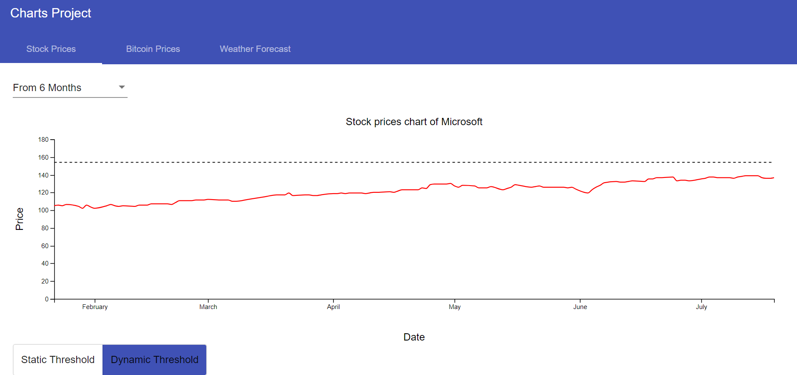
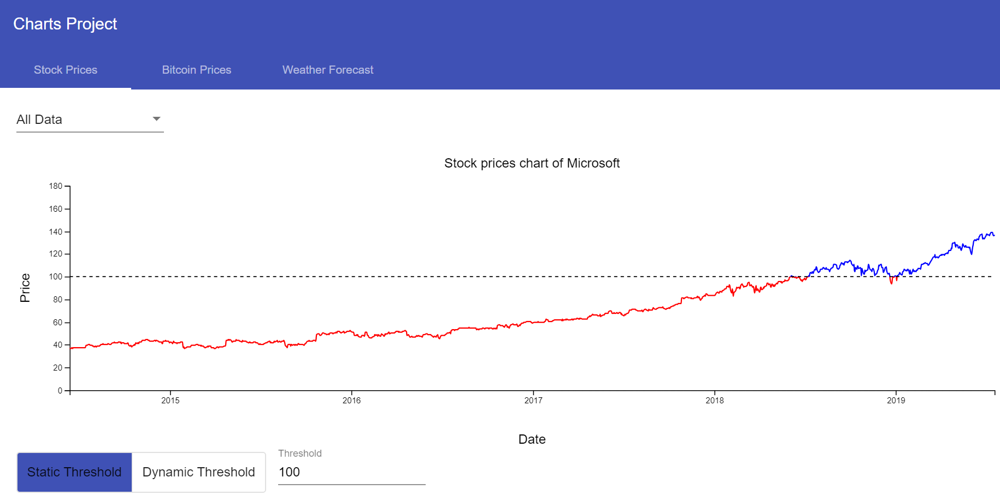
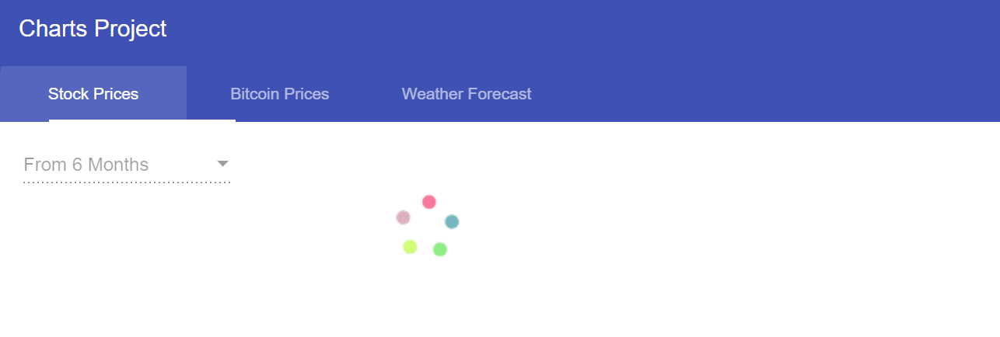
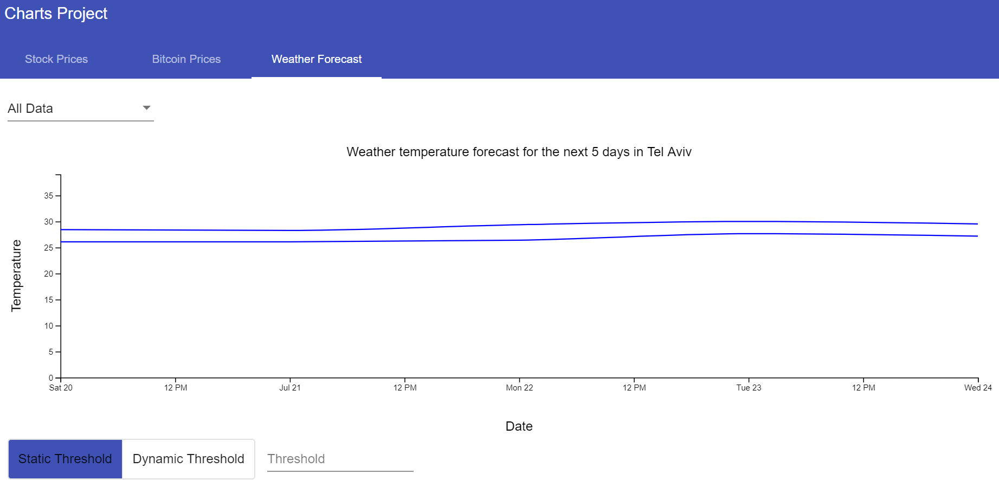

# My Charts Project

Project to show D3 line charts from public API's data

Features:
* Visualize data in line chart made with D3.
* Ability to set threshold:
  Static threshold: according to user input, points above threshold will be marked
  Dynamic threshold: threshold will be calculated according to 3-Sigma algorithm
  
* Ability to limit data metric by time range
* Input form validations
* Spinner when loading data
* Toaster notification when there is an error

Images:

This project was developed with Angular 8.0.1.
